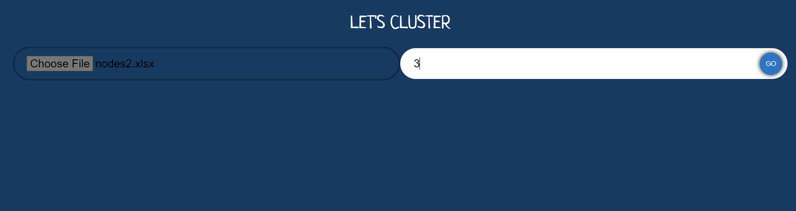
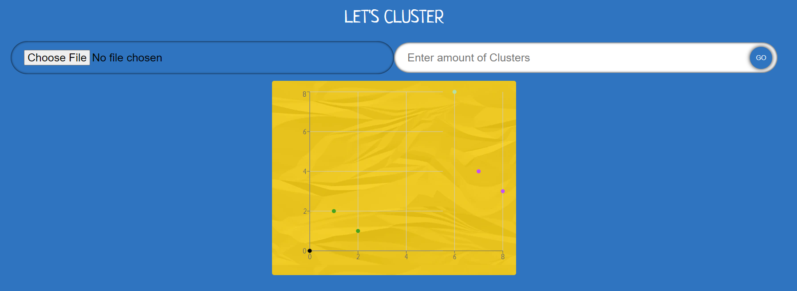
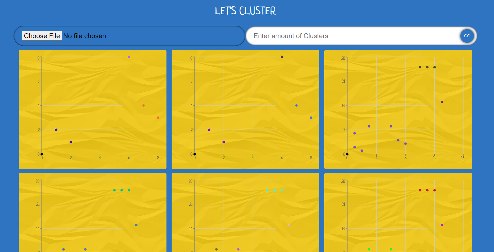

# Deskripsi Program

Program ini merupakan frontend website untuk tugas MST-Based Clustering yang diiprogramkan menggunakan typescript dengan bootstrap vite. Program dapat menerima input file berupa excel yang berisi titik-titik dengan sumbu x dan y serta jumlah yang ingin dicluster.  Program ini dapat memvisualisasi hasil dari clustering.

# Teknologi dan Framework

Frontend dari program ini menggunakan bahasa typescript sedangkan vite digunakan sebagai alat untuk proses development frontend. Typescript merupakan bahasa object-oriented yang dikembangkan oleh Mircrosoft Corporation. Biaanya typescript digunakan untuk membuat web app berskala besar.

# Screenshot Hasil Percobaan

 \
**Fig 1.** Menerima input file dan cluster\
 
 \
**Fig 2.** Menampilkan hasil clustering\
 
 \
**Fig 3** Menampilkan log visualisasi
 

# Cara Menjalankan Aplikasi
Prerequisuite:
    Docker
1. Clone repository ini, kemudian redirect ke dalam folder client.
2. Ketik pada cmd `docker compose up -d`
3. Telusuri pada web browser `https://localhost:5000`

# Referensi Belajar
credits to: \
https://docs.gofiber.io/ \
https://www.typescriptlang.org/docs/handbook/typescript-in-5-minutes.html \
https://www.youtube.com/watch?v=QevhhM_QfbM&t=163s
